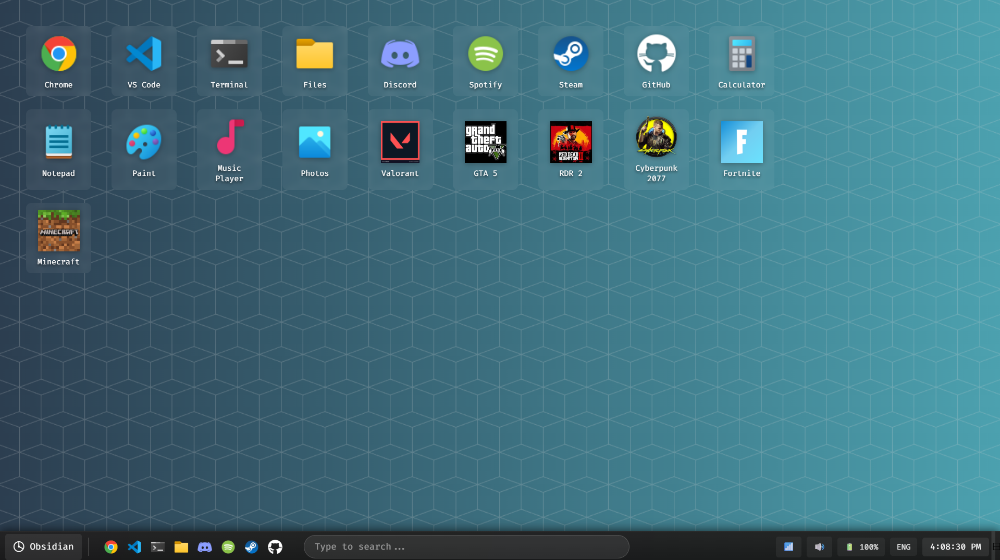

# Obsidian OS

## A Modern, High-Performance Operating System

### *Built for Performance, Security, and Innovation*

---

## Core Features

### **Performance & Optimization**
- **Fast Boot**: Optimized boot sequence for rapid system startup
- **Intelligent Caching**: Advanced memory management for improved responsiveness
- **Efficient Multitasking**: Support for concurrent application execution with intelligent resource allocation
- **Dynamic Resource Management**: Automatic CPU and memory optimization based on workload

### **User Interface**
- **Modern Design**: Clean, intuitive interface with customizable themes
- **Accessibility Features**: Comprehensive support for users with diverse needs
- **Voice Commands**: Natural language processing for hands-free operation
- **Multi-language Support**: Interface localization for global users

### **Security & Privacy**
- **Advanced Encryption**: Industry-standard encryption protocols (AES-256)
- **Regular Security Updates**: Automated vulnerability patching and security improvements
- **Multi-factor Authentication**: Support for biometric and token-based authentication
- **Privacy Controls**: Granular permissions and data protection features
- **Secure Boot**: Protected boot process to prevent unauthorized system modifications

---

## System Performance

### **File System & Storage**
- **Optimized I/O Operations**: Enhanced file transfer and disk access performance
- **Advanced Indexing**: Fast file search capabilities across large datasets
- **Data Compression**: Built-in compression support for efficient storage utilization
- **Virtual Memory Management**: Intelligent paging and swap management

### **Graphics & Display**
- **High-Resolution Support**: Native support for 4K and 8K displays
- **Hardware Acceleration**: GPU-accelerated rendering for graphics-intensive applications
- **HDR Support**: Compatible with HDR10 and Dolby Vision standards
- **Multi-monitor Configuration**: Seamless support for multiple display setups

### **Power Management**
- **Battery Optimization**: Intelligent power-saving modes to extend battery life
- **Process Suspension**: Automatic hibernation of inactive background processes
- **Adaptive Brightness**: Display optimization based on ambient lighting
- **Thermal Management**: Dynamic CPU throttling to prevent overheating

---

## Connectivity & Compatibility

### **File Format Support**
- **Wide Format Compatibility**: Support for common document, media, and archive formats
- **Cross-Platform Standards**: Compatibility with industry-standard file systems
- **Legacy Support**: Backward compatibility with older software and file types
- **Format Conversion**: Built-in tools for converting between common formats

### **Networking**
- **Modern Protocol Support**: IPv4/IPv6, TCP/IP, and modern networking standards
- **VPN Integration**: Built-in support for secure VPN connections
- **Network Diagnostics**: Comprehensive tools for troubleshooting connectivity issues
- **File Sharing**: Secure protocols for local and remote file sharing

### **Device Integration**
- **Peripheral Support**: Compatibility with standard USB, Bluetooth, and Wi-Fi devices
- **IoT Connectivity**: Integration with smart home devices and IoT platforms
- **VR/AR Support**: Drivers for virtual and augmented reality hardware
- **Cloud Services**: Integration with major cloud storage providers

---

## Development Environment

### **Developer Tools**
- **Programming Language Support**: Built-in compilers and interpreters for major languages
- **Integrated Debugging**: Comprehensive debugging tools and system APIs
- **Development Libraries**: Standard libraries and SDKs for application development
- **Package Management**: Built-in package manager for software installation
- **Version Control Integration**: Native Git support and repository management

### **Virtualization & Containerization**
- **Virtual Machine Support**: Hypervisor for running guest operating systems
- **Container Runtime**: Native support for Docker and containerized applications
- **Isolated Environments**: Sandbox capabilities for testing and development
- **Resource Isolation**: Secure separation of development and production environments

---

## Gaming Support

### **Gaming Features**
- **Graphics Optimization**: Hardware acceleration for improved gaming performance
- **Controller Support**: Compatibility with major gaming controllers and peripherals
- **Screen Recording**: Built-in tools for capturing gameplay footage
- **Streaming Integration**: Support for popular streaming platforms
- **Game Mode**: Dedicated mode that prioritizes gaming performance
- **DirectX/Vulkan Support**: Modern graphics API compatibility

---

## Multimedia Capabilities

### **Content Creation**
- **Basic Image Editing**: Built-in tools for photo viewing and editing
- **Video Playback**: Support for common video formats with hardware decoding
- **Audio Tools**: Basic audio recording and editing capabilities
- **Screen Capture**: Screenshot and screen recording functionality
- **Media Codecs**: Comprehensive codec support for various media formats

### **Media Management**
- **Media Library**: Organize and manage photo, video, and music collections
- **Metadata Support**: View and edit file metadata and properties
- **Format Conversion**: Tools for converting between media formats
- **Batch Processing**: Efficient handling of multiple files simultaneously

---

## Automation & Productivity

### **Intelligent Features**
- **Smart Notifications**: Contextual alerts and system notifications
- **Quick Actions**: Automated shortcuts for common tasks
- **Search Integration**: System-wide search for files, settings, and applications
- **Assistant Features**: Voice-activated commands for system control
- **System Diagnostics**: Automated health checks and maintenance alerts

### **Task Automation**
- **Scripting Support**: Command-line tools and scripting capabilities
- **Scheduled Tasks**: Cron-like task scheduler for automated operations
- **Workflow Automation**: Tools for creating custom automation workflows
- **Batch Operations**: Support for automating repetitive tasks

---

## Accessibility & Localization

### **Accessibility Features**
- **Screen Reader**: Text-to-speech support for visually impaired users
- **Voice Navigation**: Voice control for system navigation
- **High Contrast Themes**: Enhanced visibility options for better readability
- **Keyboard Navigation**: Full keyboard accessibility support
- **Assistive Technologies**: Compatibility with third-party accessibility tools

### **Language & Regional Support**
- **Multi-language Interface**: Support for major world languages
- **Input Methods**: International keyboard layouts and input systems
- **Regional Settings**: Date, time, and number format customization
- **Unicode Support**: Full international character set compatibility

---

## Customization & Personalization

### **Visual Customization**
- **Themes**: Multiple built-in themes with light and dark mode options
- **Wallpapers**: Support for custom backgrounds and image galleries
- **Color Schemes**: Customizable accent colors and UI elements
- **Desktop Widgets**: Configurable widgets for quick information access
- **Window Effects**: Transparency and visual effects options

### **Advanced Configuration**
- **Keyboard Shortcuts**: Customizable hotkeys for common operations
- **Window Management**: Tiling, snapping, and multi-window arrangements
- **Virtual Desktops**: Multiple workspace support for better organization
- **System Settings**: Comprehensive configuration options for all features

---

## System Management

### **Maintenance Tools**
- **System Updates**: Automated update management with rollback capability
- **Disk Optimization**: Scheduled maintenance for storage devices
- **Error Reporting**: Diagnostic tools for troubleshooting system issues
- **Cleanup Utilities**: Tools for managing temporary files and system cache
- **Backup & Restore**: System backup and recovery options

### **System Monitoring**
- **Resource Monitor**: Real-time CPU, memory, and disk usage tracking
- **Performance Logs**: Historical data for system performance analysis
- **Task Manager**: Comprehensive process and application management
- **Network Statistics**: Monitor network usage and connection status
- **Hardware Information**: Detailed system hardware specifications

---

## Built-in Applications

### **Core Applications**
- **File Manager**: Advanced file browsing with search and preview capabilities
- **Web Browser**: Modern browser with privacy and security features
- **Text Editor**: Syntax highlighting and programming support
- **Media Player**: Video and audio playback with codec support
- **Image Viewer**: Fast image browsing and basic editing tools
- **Calculator**: Scientific calculator with unit conversion
- **Terminal**: Command-line interface with multiple shell support
- **System Settings**: Centralized configuration management
- **App Store**: Software repository for installing additional applications
- **Archive Manager**: Compression and extraction for various formats

---

## Advanced Features

### **System Recovery**
- **System Snapshots**: Create restore points for system recovery
- **Safe Mode**: Diagnostic startup mode for troubleshooting
- **System Restore**: Roll back to previous stable configurations
- **Extension Manager**: Install and manage third-party extensions
- **API Documentation**: Developer resources for system integration

### **Enterprise Features**
- **Domain Support**: Active Directory and LDAP integration
- **Centralized Management**: Group policy and remote administration
- **Remote Access**: Secure remote desktop capabilities
- **Device Management**: Enterprise deployment and configuration tools
- **Compliance Support**: Security and privacy compliance frameworks

---

## Licensing & Support

### **License Information**
- **Open Source**: Core system components available under open-source license
- **Free for Personal Use**: No cost for individual users
- **Commercial Licensing**: Available for enterprise deployments
- **Privacy Focused**: Minimal telemetry with user consent
- **Transparent Development**: Public development roadmap and issue tracking

### **Support Resources**
- **Documentation**: Comprehensive user and developer guides
- **Community Forum**: Active community for discussions and support
- **Issue Tracking**: Public bug reporting and feature requests
- **Release Notes**: Detailed changelog for each version
- **Support Channels**: Email and forum-based technical support

---

## System Requirements

### **Minimum Requirements**
- **Processor**: 64-bit dual-core processor (2.0 GHz or higher)
- **RAM**: 4 GB
- **Storage**: 25 GB available space
- **Graphics**: DirectX 12 compatible graphics card
- **Display**: 1024 x 768 resolution
- **Internet**: Required for updates and online features

### **Recommended Specifications**
- **Processor**: 64-bit quad-core processor (3.0 GHz or higher)
- **RAM**: 8 GB or more
- **Storage**: 50 GB SSD
- **Graphics**: Dedicated GPU with 2GB VRAM
- **Display**: 1920 x 1080 or higher resolution
- **Internet**: Broadband connection for optimal experience

---

## Development Roadmap

### **Upcoming Features**
- **Improved Performance**: Ongoing optimization for faster boot and application loading
- **Enhanced Security**: Regular security updates and new protection features
- **Better Hardware Support**: Expanded driver compatibility
- **UI Refinements**: Continued improvements to user interface and experience
- **Developer Tools**: Enhanced APIs and development environment
- **Cloud Integration**: Improved synchronization with cloud services

---

## Getting Started

To learn more about Obsidian OS or download the latest release, visit our official resources:

**Website**: www.obsidianos.io  
**Email**: support@obsidianos.io  
**Community**: discord.gg/obsidianos  
**Twitter**: @ObsidianOS  
**GitHub**: github.com/obsidianos

---

*Obsidian OS - A Modern Operating System for Everyone*

**Version 2025.10**
